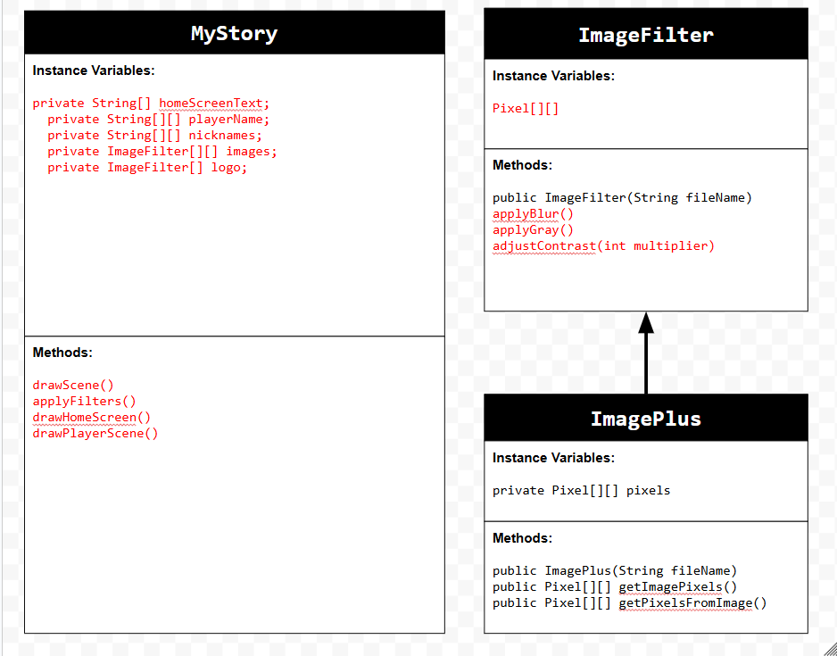
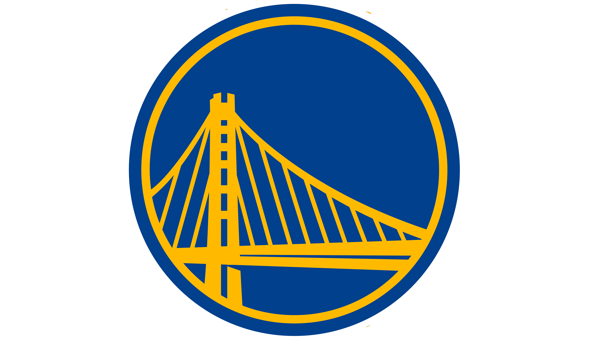

# Unit 4 - Personal Narrative

## Introduction

Images are often used to portray our personal experiences and interests. We also use image filters and effects to change or enhance the mood of an image. When combined into collages and presentations, these images tell a story about who we are and what is important to us. Your goal is to create a personal narrative using The Theater that consists of images of your personal experiences and/or interests, incorporates data related to these experiences and/or interests that can be organized in a 2D array, and uses image filters and effects to change or enhance the mood of your images.

## Requirements

Use your knowledge of object-oriented programming, two-dimensional (2D) arrays, and algorithms to create your personal narrative collage or animation:

- **Create at least two 2D arrays** – Create at least two 2D arrays to store the data that will make up your visualization.
- **Implement one or more algorithms** – Implement one or more algorithms that use loops and two-way or multi-selection statements with compound Boolean expressions to analyze the data.
- **Use Image Filters** - Include multiple image filters learned from this unit, and additionally create new ones of your own.
- **Use methods in the String class** – Use one or more methods in the String class in your program, such as to determine whether the name of an image file contains specific characters.
- **Create a visualization** – Create an image or animation that conveys the story of the data by illustrating the patterns or relationships in the data.
- **Document your code** – Use comments to explain the purpose of the methods and code segments and note any preconditions and postconditions.

## UML Diagram

Put and image of your UML Diagram here. Upload the image of your UML Diagram to your repository, then use the Markdown syntax to insert your image here. Make sure your image file name is one work, otherwise it might not properly get display on this README.

## Video

Record a short video of your story to display here on your README. You can do this by:

- Screen record your project running on Code.org.
- Upload that recording to YouTube.
- Take a thumbnail for your image.
- Upload the thumbnail image to your repo.
- Use the following markdown

)

## Story Description
My story showcases the 2017 prime Golden State Warriors Team and their best players. I chose this because they are my all-time favorite team and it they motivated me to improve my basketball skills. The data in my project that is represented in 2D arrays are the player names, player nicknames, and the images of each player. These are represented in my story using images and text.
## Image Filter Analysis

1. Contrast Adjustment: The adjustContrast method changes the intensity of an image's colors by multiplying the red, green, and blue values by a multiplier. A higher multiplier makes the image brighter with more contrast, while a lower multiplier darkens the image. This adjusts the image by making it more vibrant or subtle

2. Grayscale: The applyGray method converts the image to grayscale by taking the average of the red, green, and blue pixels and applying the result to all colors, removing color from the image, leaving only gray.